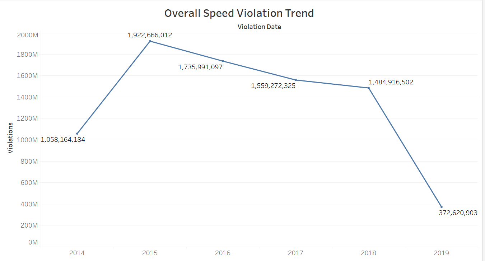
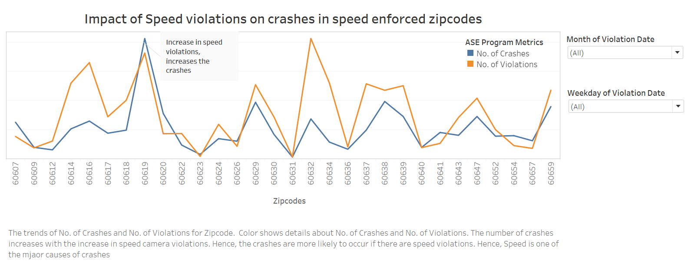
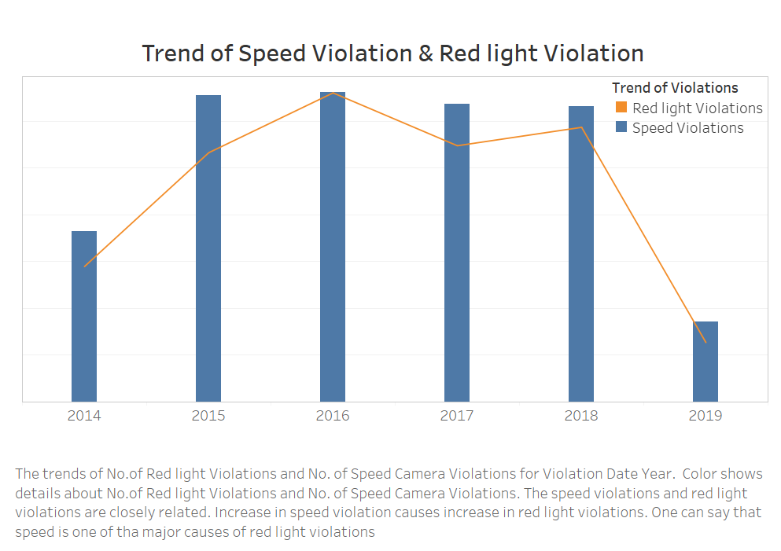
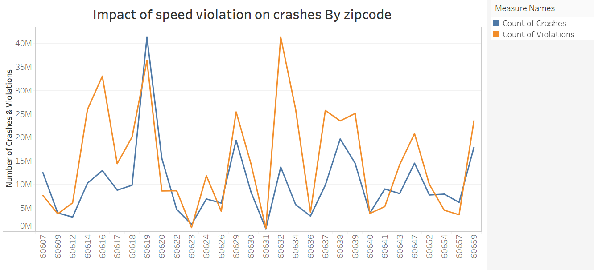
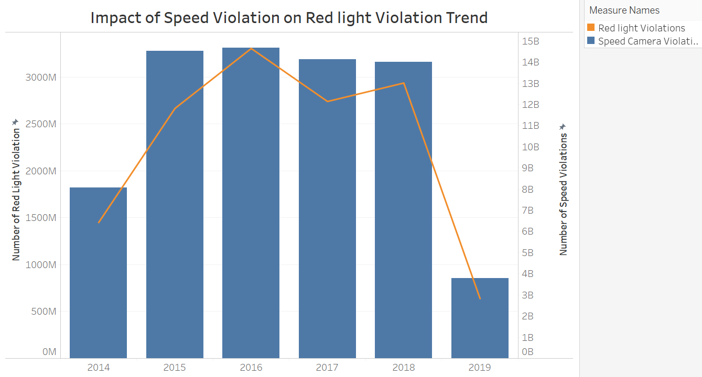

### Individual Project - Revised Version 

###### Submitted By Vikita Nayak

#### Table of Contents

|Sr.no| Content|
|--------|--------|
|1       | Background|
|2       |Goal of this Project|
|3       | About the Datasets|
|4       | Final Dataset Creation|
|5       | Dataset Reference|
|6       | Goal of this analysis|
|7       | erivation of Insights from the final datasets|
|8       | Graph Comparison |
|9       | Dashboards Comparison|
|10      | Summary|

#### 1. Background: 

This document is the revised version of the individual Project [Exploratory Data Analysis](https://github.com/VikitaNayak/Individual-Project/blob/master/README.md) and [First Version](https://github.com/VikitaNayak/Individual-Project-First-Version/blob/master/README.md).
- The Individual Project Exploratory Data Analysis included 5 distinct visualizations which were created from the Speed Camera Violation dataset. 
- The Individual Project first version included finding 3 key insights from the data analysis of 4 different datasets including Speed Camera Violation dataset

#### 2. Goal of this project: 
- The final version of your data product.
- A documentation of your data product.
- The final version should make use of advanced and interactive features of Tableau

#### 3. About the Datasets

In total, 4 datasets have been used for this analysis and below are those:
-  Dataset 1 : Speed Camera Violation
-  Dataset 2 : Traffic Crashes - Crashes
-  Dataset 3 : Red light Violation
-  Dataset 4 : Ward Dataset

##### 4. Final Dataset creation:

- Data cleaning in python and excel to remove the null values and extra columns 
- Extracted zipcodes from location in traffic crashes datasets using google API in python. [Code for reference.](https://github.com/VikitaNayak/Individual-Project-First-Version/blob/master/%5BIndividual%20Project%5D%20Python%20code%20to%20generate%20zipcodes%20from%20location.ipynb)
- Extracted zipcodes from Ward Dataset and Vlookuped in the Speed Camera Violation Dataset
- Extracted zipcodes from Ward Dataset and Vlookuped in the Red Light Camera Violation Dataset
- Removed extra columns not required for analysis from all three tables
- Merged (joined) the above 3 datasets in Tableau based on zipcodes

###### 5. Dataset Reference

- Ward Dataset Reference : https://data.cityofchicago.org/Facilities-Geographic-Boundaries/Ward-Offices/htai-wnw4

- Data set 1 Reference :https://data.cityofchicago.org/Transportation/Speed-Camera-Violations/hhkd-xvj4)

- Data set 2 Reference : https://data.cityofchicago.org/Transportation/Traffic-Crashes-Crashes/85ca-t3if)

- Data set 3 Reference : https://data.cityofchicago.org/Transportation/Red-Light-Camera-Violations/spqx-js37

#### 6. Goal of this analysis:

The goal of this analysis is to measure the effectivity of the Automated Speed Enformcement (ASE) program is in Chicago. Under ASE program, speed cameras has been installed in the childern safety zones of chicago. These cameras capture speed violations in these areas. It is important to have this program in these areas as a part of safety for children by slowing donw the speed of vehicles in these areas and avoiding the crashes. 

Our main aim is to reduce the number of crashes in the children safety zones of Chicago and the main questions to be anwered with this analysis are :
- (1) Is there any impact of this program on the number of speed violations in the speed camera enforced areas?
- (2) Is there any impact of this program on the number of crashes in the speed camera enforced areas?
- (3) Is there any impact of speed violations on red light violations which is one of the major causes of crashes?
- (4) Are the drivers aware of this program?

#### 7. Derivation of Insights from the final datasets

##### Insight 1: Does decreasing speed violation also reduces the number of accidents in that area?

##### Analysis: 
The idea here is to analyze impact of speed camera violations on number of crashes. Since, speed is one of the major causes of the crashes, it is important to see how these two are related in speed camera enforced areas. It has been observed that over the period of time, the number of speed violations are decreasing under the Automated Speed Enformcement (ASE) program in chicago. 

Trend of speed violations under ASE in chicago  |  Trend of speed violations and crashes in speed camera enforced areas
 

-  From Graph 1, it is clear that under ASE program, the speed violations are reducing over the period of time
-  From Graph 2, it seems that number of crashes are closely related to the number of speed violations under speed camera enforced areas
-  From these two graphs, we can say that the ASE program is effective as the number of speed violations are reducing. Since the number of crashes and speed violations are related, we can say that under ASE program, number of crashes are reducing as the number of speed violations are reducing.

##### Recommendations : 
Under ASE Program, more areas should be enforced with speed cameras as it has been observed that the speed camera violations are reducing in speed camera enforced areas and due to which the number of crashes are also reducing in those areas. This will help to reduce the overall number of accidents in chicago and making the 'Vision Zero' successful in child safety zones of chicago ensuring children's safety.

##### Insight 2: Does installing new cameras under ASE program reduces the number of speed violations?

##### Analysis: 
Since the installing cameras adds costs to the city, Let's analyze whether adding new cameras under ASE program reduces the number of speed violations and indirectly reduces number of crashes.

- The graph shows that the number of camera installation under ASE program has increased from 2014 to 2019
- It also shows that the average number of speed violations are decreasing from 2014 to 2019
- It clearly shows that there is an impact of more camera installation under ASE program
- The drivers are now more aware of the ASE program and are driving carefully to avoid the speed violation tickets

##### Observation: 
This graph shows how effective the ASE program is where adding the new cameras has reduced the number of speed violation and which can reduce the number of crashes. Also, during year 2015 to 2017, though the camera number were constant, the number of speed violation kept decreasing. One can infer that during the initial phase of the camera installation, not many people were aware of this system but with time, they became aware of this system and hence the speed violation decreases though the speed camera installation number were constant for some period

##### Insight 3 : Does Speed violation also causes red light violation?

##### Analysis : 
Red light violation is one of the major reasons for crashes. Let's analyze the impact of implementing the ASE program on red light violation as majority of the red light violations occur due to high speed. Hence, below is the graph of impact of speed camera violation on red light violation

- The graph shows the correlation between speed camera violation and the red light violation over the period of time.
- It is evident that the red light violations increase with the increase in speed camera violation and decrease with the decrease in the speed camera violations

##### Observation: 
We found that with decrease in the number of speed violations, there is decrease in the number of red light violations which is one of the major causes of the crashes. The lesser speed violation leads to lesser red light violation as the speed is in control and the drivers are able to stop on the red light. High speed vehicles are not easier to stop on red light and this leads to increase in the number red light violations

### 8. Graph Comparison

#### Visualization 1 

This is a dual chart representing the co relation between number of speed violations and number of crashes for speed enforced areas. 

##### Reason for selecting chart type: 
The line chart has been selected here as I wanted to show the trend and line is the best representation of trend where we do not want the number just want to see the trend or co-relation. 

##### First Version Improvements 

- The Y axis can be removed and legends can be made more meaningful
- The X axis title is missing and it can be difficult for viewers to identify the zipcodes on X axis 
- The title can be made better
- The caption can be added to give more information
- The measure names title and values can be made more meaningful
- The Annotation can be added to highlight the main point
- The gridlines can be removed as the graph is just showing the trend and not any numbers

##### Revised Version

- The Y axis title is removed to avoid confusion and legends are made more meaningful
- The Measure value title and names are changed to ASE Program Metrics & Number of crashes & Number of violations
- The grid lines are removed as the graph is just showing the trend
- The caption is added to give clear insight of the graph
- The Annotation is added to highlight the main point.
- Updated the main title of the graph to make the message of the graph more clear
- The X axis is gien name now which makes it clear that the X axis represents Zipcodes
- The Filters of month and day are added for user interactivity

#### Comparison

|**First Version**                                       |          **Revised Version**                 |
|--------------------------------------------------------|----------------------------------------------|
|         | |
| Graph 1                                                |  Graph 2                                     |

|**First Version**                                       |          **Revised Version**                 |
|--------------------------------------------------------|----------------------------------------------|
|No Caption	                                             | Caption addded to give more clarity          |
|Un clear Title                                          | Updated title to give more clarity           |
|No Annotation	                                         | Added Annotation to give more clarity        |
|Unnecessary gridlines	                                 |Removed the gridlines to show trend           |
|Measure title and values are not clear	                 |Updated the Measure title and values to make them meaningful|
|The Y axis title creates confusion as it is a dual axis chart	|Y axis title is hidden to avoid confusion and legends are made more meaningful|
|No filters for user interactivity	                     |Global Filter of month & day for user interactivity|

#### Visualization 2

This is a dual chart showing co-relation between number of camera installed under ASE program of chicago and average number of violations

##### Reason to select the chart type:  

To show co-relation between two attributes and the trend over the period of time, a line chart can be used to better represent it with dual axis chart

##### First Version Improvements
- The measure title and values can be updated to make it more meaningful
- Trend line can be shown
- No caption
- The Y axis title can be made more meaningful

##### Revised Version

- Added caption to make it more meaningful
- Updated Measure name title and values to make it more meaningful
- Updated Y axis title to make it more clear
- Trend lines are shown
- Global Filters are added for user interactivity

#### Comparison

|**First Version**                                       |          **Revised Version**                 |
|--------------------------------------------------------|----------------------------------------------|
|        | |

|**First Version**                                       |          **Revised Version**                 |
|--------------------------------------------------------|----------------------------------------------|
|No Caption	                                             | Caption addded to give more clarity          |
|Un clear Title                                          | Updated title to give more clarity           |
|No Trend line	                                         | Added trend line                             |
|Measure title and values are not clear	                 |Updated the Measure title and values to make them meaningful|
|No filters for user interactivity	                     |Global Filter of month & day for user interactivity|

#### Visualization 3

This is a dual chart showing trend of red light violations and speed violations in speed camera enforced areas

#### First Version

- The bar size is too big
- The Y axis title is confusing as it is a dual chart
- The title can be updated to make it more meaningful
- Caption can be added to make it more meaningful
- The measure name title and values can be udpated for clarity

#### Revised Version

- The bar size is set properly 
- The Y axis title are removed and legends are made meaningful for clarity
- The title is updated to make the message more clear
- Caption added to give more information 
- Global filter are added for user interactivity

#### Comparison

|**First Version**                                       |          **Revised Version**                 |
|--------------------------------------------------------|----------------------------------------------|
|        | |

|**First Version**                                       |          **Revised Version**                 |
|--------------------------------------------------------|----------------------------------------------|
|No Caption	                                             | Caption addded to give more clarity          |
|Un clear Title                                          | Updated title to give more clarity           |
|The bar width is too big                                | The bar width has been reduced                            |
|The Y axis title creates confusion as it is a dual axis chart	|Y axis title is hidden to avoid confusion and legends are made more meaningful|
|Measure title and values are not clear	                 | Updated the Measure title and values to make them meaningful|
|No filters for user interactivity	                     | Global Filter of month & day for user interactivity|

#### 9. Dashboards Comparison

|**First Version**                                       |          **Revised Version**                 |
|--------------------------------------------------------|----------------------------------------------|
|The chart placement was random (one after the other)    | The charts are placed in logical order       |
|No user interactivity                                   | Interactive dashboard by creating global filters of month & days which is applicable to all the charts|
|Caption in the dashoard making it wordy                 | Caption removed                              |
|Title of the dashboard is not effective                 | Added suitable dashboard title               |

#### 10. Conclusion

The revised version graphs have some of the common updates like:
- The titles are updated in all the visualizations to make the message clear
- Added captions for all visualizations to give more information about the charts
- Created global filter (Month & Day) on dashboard for user interactivity
- Updated the legend title and names
- Trend lines are shown
- Y axis title are hidden to avoid confusion due to dual axis charts

This version is better than the first version as it is more clear and lucid. The graphs & dashboard can help the mayor of chicago to see the effectivity of the ASE Program. Major takeaways from this visualization for the mayor will be 

- To cover more areas under ASE program so that speed violations can be reduced.
- The awarness of the ASE Program has been increased over the period of time and it is effective.
- Speed is one of the major causes of crashes and red light violations.

